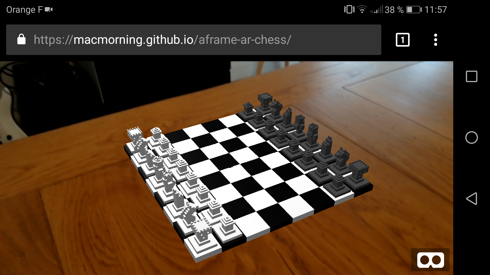
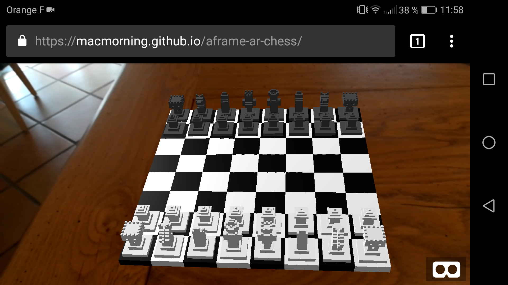

# aframe-ar-chess
This is a little project built from aframe-chess to learn WebAR with @aframe-vr.

# view current state here
https://macmorning.github.io/aframe-ar-chess/

Works with the [Hiro marker](https://jeromeetienne.github.io/AR.js/data/images/HIRO.jpg) for now.

